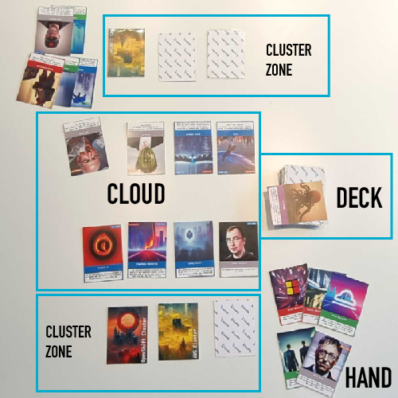

# Cluster Royale
An open source game for cloud natives.

# Obtaining the game
You can download and print your set of cards [here](https://github.com/sysdiglabs/game-of-pods/tree/main/docs/cards/exports/printpdfs). It's free!!!

# Quick Summary
Cluster Royale is a game where you’ll take both the role of a cyber attacker and cyber defender.
The goal of the game is to defend your own clusters while destroying (or stealing!) other players clusters.  
When a player controls no clusters, he is removed from the game.  
The last player remaining wins the game, bragging rights and eternal glory in the cloud world!

# Rules
## Players
2 to 4 players

## Cards

The game has: 
* 12 Cluster cards
* 71 Regular Cards

There are 6 different card types in Cluster Royale:
* **Clusters**: these are your main resources. They are dealt at the start of the game to every player, but some cards allow you to get new ones during the game.
* **Celebrities** (Grey): these are permanent cards that can give you a bonus when played. You can build a strategy around your powerful celebrity… or not, some might have downsides.
* **Techs** (Blue): these are permanent cards that give you a net bonus every turn. Very powerful, try to have synergies between the techs you deploy!
* **Cyber attacks** (Red): these one-time cards allow you to destroy or steal other players' clusters.
* **Cyber defenses** (Green): these one-time cards allow you to defend from other players' attacks.
* **Events** (Purple): these are cards that when drawn trigger immediately, with effects often involving all the players.

In addition to these types, **Techs** and **Celebrities** cards have _faction labels_ as part of the card.  
Some effects might apply only to cards of a specific faction, as ruled by the card text.

## Preparing the game
Take all **Clusters** cards and all **Events** cards (purple frame) out of the deck and leave them in two separate piles.

Proceed with cluster distribution: deal 3 random cluster cards to each player.   
If there are 3 players, deal 1 more cluster card (total of 4 each).   
If there are 2 players, deal 1 more (total of 5 each).   

Put any remaining cluster card in the cluster discard pile, face up.  
Players place the cluster cards face down in front of them.

Deal 5 cards to every player. When done, shuffle the events card back in the deck.  
The player who last deployed in production is the one starting the game.

In short, each player receives:

* 3 to 5 clusters, depending on the number of players
* 5 cards in hands.

## Overview
The objective of the game is to eliminate all the clusters from other players.

Each turn, the player draws a card from the deck and can play one of the cards in the hand.

The game ends when there is only one player with clusters running.

## How to play

Players can play cards during their turn. 
A player turn plays out like follows:

* First, any card effects that says “at the beginning of your turn” gets triggered
* Then a player plays up to one **Tech** card from his hand, and up to one **Celebrity** card from his hand. **Tech** and **Celebrity** cards are permanents: they stay in play face up in front of the player, as long as they are not destroyed by another card effect.
* A player can then play up to one **Cyber attack** or **Cyber defense** card. These cards are played and discarded immediately after their effects resolve.
* As the last action of the turn, a player draws a card from the top of the deck:
  * if there are no cards in the deck, shuffle the discarded cards pile and put them in the deck.
  * if a player draws an **Event** card, that card is played immediately, its effects apply and it is discarded. In case an Event triggers one or more subsequent Events (e.g., all players need to draw a card, and some players draw Event cards), the subsequent Events trigger at the end of the effects of the first event, following the players sequential order.
* The turn then passes to the next player (on the left side of the player).
* If a player at any given moment controls no clusters, they are removed from the game.
  * That means that even if a player could make a move to restore one of their clusters, at the moment their last cluster is destroyed he is removed from the game.
* The last player remaining that controls clusters wins the game.

## Play Celebrity or Tech cards

You can play a **Celebrity** or **Tech** card from your hand. Put them in front of your clusters. Celebrity and Tech cards stay in play on your side unless destroyed or stolen by another player. Some of these cards will grant a benefit when they enter the Cloud and some of these will grant a benefit each of your turns, or while they are in play.

You can play **maximum one Celebrity and one Tech** card per turn. This means that you can play one Celebrity and Tech card in the same turn.

Both Celebrity and Tech may have a label indicating their allegiance, like:

* Open-source
* Sysdig
* Corporation
* Java
* Windows
* Cloud provider
* Microservice
* Runtime observability
E.g: Loris has the Falco tag and open-source tag.
E.g: Melon Usk has the corporation tag.

## Play up to **one** Attack or Defense card
Choose any card in your hand with the Attack or Defense type. 
Some Attack cards target specific cluster types (AWS, GCP, Openshift or Azure). In that case, target a cluster and reveal it. If the cluster is of the type indicated in the Attack type, destroy it, putting in the discard pile. 

If the **last cluster** from a player is destroyed, **that player is removed from the game**.

## Draw a card from the deck
Draw the top card from the deck. Your turn ends and now it's the turn of the next player (on your left side).

## Game zones

* Cloud: this is the play area, where permanent cards are played
* Cluster zone: this is where your clusters reside. If it's empty, you're out!
* Clusters discard pile: this is where destroyed clusters go.
* Discard pile: this is where all the other cards go when played and not in the cloud.
* Deck: the pile of cards the players draw from.
* Hand: the cards the players hold in their hands, hidden from the other players.

## Special Words
* **Reveal**: Turn a face down card face up. If the card is in hand, show it to the other players and keep it in view.
* **Destroy**: destroyed permanents (Techs, Celebrities) are removed from the play zone (“The Cloud”) and put in the discarded cards pile. Destroyed Clusters are put in the cluster discard pile.
* **Steal**: take control of target permanent. Bonus granted by target permanent apply to you, but “Enters the cloud” effects do not trigger again if the permanent was already in play.
* **May, up to**: some card texts leave the option open to the player to decide how to play the effects. Bribing other players with beers in order to get them to be lenient (or not) in their decisions is not against the rules.

## Extended rules

There are other ways to play this game: 

* **Blue-team vs Red-team**: There are 2 teams, the defenders, and the attackers. Each team has 2-3 players and they share the clusters. You have to **trust the team** to defend your infra and defeat your opponents. The turns are alternating between components of each team.

