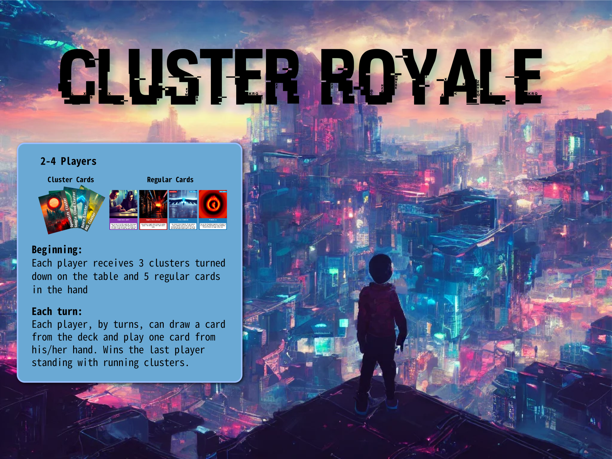
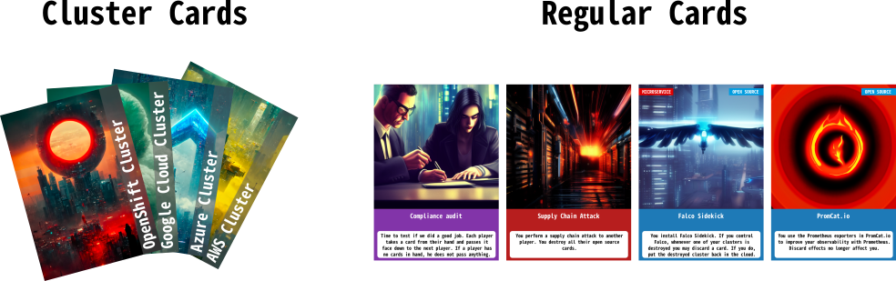

# Cloud Royale (A Game of Pods)
An open source game for cloud natives

# Obtaining the game
You can download and print your set of cards [here](https://github.com/sysdiglabs/game-of-pods/tree/main/docs/cards/exports/printpdfs). It's free!!!

# Rules
## Players
2-4 players

## Cards

The game has: 
* 12 Cluster cards
* 71 Regular Cards

The regular cards can be: 
* Defense (Green)
* Offense (Red)
* Tech (Blue)
* Celebrity (Grey)
* Event (Purple)

## Preparing the game
Each player receives:
* 3 Cluster cards in the table facing down
* 5 Regular cards in the hand

## Overview
The objective of the game is to eliminate all the clusters from other players.

Each turn, the player draws a card from the deck and can play one of the cards in the hand.

The game ends when there is only one player with clusters running.

## How to play

Shuffle all cluster cards and deal 3 cards to each player (2 cards in a 4-player game) face down, so they are not visible to the rest of the players.

Shuffle the cloud deck and deal 5 cards to each player. This will form their hand.
The game is played in turns. The first player to play is the last one who commited a change to production.

## Turn summary

During your turn:

* Play Personality or Tech cards.
* Play up to one Attack card.
* Draw a card from the deck, indicating your turn is over

When the last cluster from a player is destroyed, that player is out of the game.

## Play Personality or Tech cards

You can play Personality or Tech card from your hand labeled as Personality (blue border). Put them in front of your clusters. Personality and Tech cards stay in play on your side unless destroyed or stolen by an opponent. Some of these cards will grant a benefit when they enter the Cloud and some of these will grant a benefit each of your turns, or while they are in play.

You can play **maximum one Personality and one Tech** card per turn. This means that you can play one Personality and Tech card in the same turn.

Both Personalities and Tech may have a label indicating their allegiance, like:

* Open-source
* Sysdig
* Corporation
* Java
* Windows
* Cloud provider
* Microservice
* Runtime observability
E.g: Loris has the Falco tag and open-source tag.
E.g: Melon Usk has the corporation tag.

## Play up to **one** Attack card
Choose any card in your hand with the Attack type. 
Some Attack cards target specific cluster types (AWS, GCP, Openshift or Azure). In that case, target a cluster and reveal it. If the cluster is of the type indicated in the Attack type, destroy it, putting in the discard pile. 

If the **last cluster** from a player is destroyed, **that player is eliminated**.

## Draw a card from the deck
Draw the top card from the deck. Your turn ends and now it’s the turn of the next player clockwise.

## Game zones
Deck
The cloud
Discard pile
Cluster discard pile
Hand

## Extended rules
There are other ways to play this game: 

* **Blue-team vs Red-team**: There are 2 teams, the defenders, and the attackers. Each team has 2-3 players and they share the clusters. You have to **trust the team** to defend your infra and defeat your opponents. The turns are alternating between components of each team.

