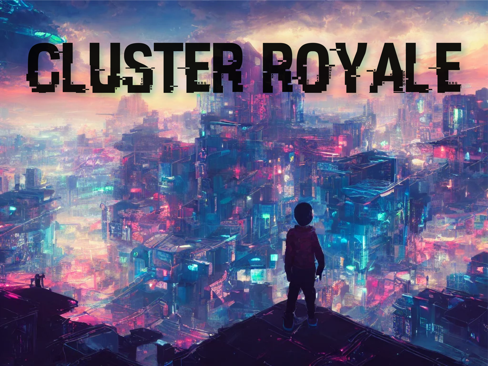

# Cloud Royale (A Game of Pods)
An open source game for cloud natives

# Obtaining the game
You can download and print your set of cards [here](https://github.com/sysdiglabs/game-of-pods/tree/main/docs/cards/exports/printpdfs). It's free!!!

# Rules
## Players
2-4 players

## Cards

The game has: 
* 12 Cluster cards
* 71 Regular Cards

The regular cards can be: 
* Defense (Green)
* Offense (Red)
* Tech (Blue)
* Celebrity (Grey)
* Event (Purple)

## Preparing the game
Each player receives:
* 3 Cluster cards
* 5 Regular cards

## Playing
The objective of the game is to eliminate all the clusters from other players.

Each turn, the player draws a card from the deck and can play one of the cards in the hand.

The game ends when there is only one player with clusters running.

## Extended rules
There are other ways to play this game: 

* **Blue-team vs Red-team**: There are 2 teams, the defenders, and the attackers. Each team has 2-3 players and they share the clusters. You have to **trust the team** to defend your infra and defeat your opponents. The turns are alternating between components of each team.

